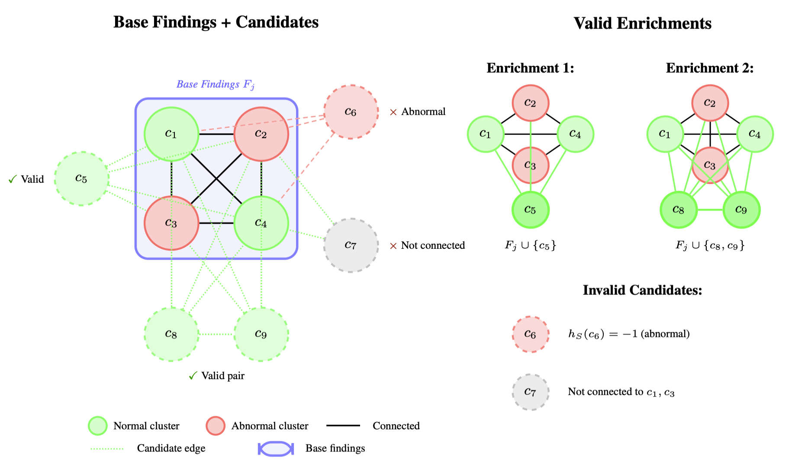

<div align="center">

# 🩺 SemEnrich: Self-Supervised Semantic Enrichment for Medical Vision-Language Models

<p align="center">
  
</p>

[📖 Paper](#) | [🎯 Demo](#) | [📊 Results](#-main-results) | [🚀 Quick Start](#-quick-start)

</div>

---

## 📋 Overview

**SemEnrich** is a novel framework for medical report generation that leverages graph-based data augmentation through semantic clustering of radiological findings. Our approach clusters semantically similar sentences from radiology reports and uses graph-based expansion to create augmented training samples, leading to improved report generation quality.

### ✨ Key Contributions

| | Contribution | Description |
|:---:|:---|:---|
| 🔬 | **Semantic Clustering** | Cluster medical findings using sentence embeddings to identify semantically similar descriptions |
| ➕➖ | **Sign Determination** | Classify clusters as positive/neutral (normal) or negative (abnormal) using LLM-based analysis |
| 📈 | **Graph-Based Expansion** | Use co-occurrence patterns to augment training data with compatible findings |
| 🎯 | **SFT Training** | We experimentally show that our augmented training data yields higher performance|
| 🎯 | **GRPO Training** | Extend Group Relative Policy Optimization for medical VLMs with custom reward functions which utilizes our semantic clusters|

---

## 📊 Main Results

### 🔧 Supervised Fine-Tuning (SFT) with Graph-Based Expansion

Performance comparison of different models and clustering methods for data expansion:

#### COMET-Kiwi Scores ↑

| Model | Base | DBSCAN | HDBSCAN | Kmeans-1000 | Kmeans-2000 | Kmeans-5000 |
|:------|:----:|:------:|:-------:|:----:|:----:|:----:|
| DS-R1-Qwen-1.5B | 63.58 | 63.65 | **67.46** | 65.76 | 67.15 | 66.52 |
| Gemma3-4B | 62.44 | 61.66 | **64.39** | 63.58 | 63.58 | 63.74 |
| DS-R1-Llama-8B | 64.40 | 64.45 | **67.32** | 66.35 | 67.11 | 66.87 |
| Qwen3-8B | 64.10 | 63.95 | **67.76** | 66.08 | 67.20 | 67.23 |
| Mistral-7B | 63.69 | 63.82 | **69.15** | 65.50 | 68.18 | 67.36 |
| *Mean* | 63.64 | 63.50 | **67.22** | 65.45 | 66.64 | 66.35 |

#### BERTScore-F1 Scores ↑

| Model | Base | DBSCAN | HDBSCAN | Kmeans-1000 | Kmeans-2000 | Kmeans-5000 |
|:------|:----:|:------:|:-------:|:----:|:----:|:----:|
| DS-R1-Qwen-1.5B | 67.50 | 67.19 | **69.63** | 68.76 | 69.34 | 69.53 |
| Gemma3-4B | 65.34 | 64.77 | 66.54 | **66.60** | 66.10 | 66.45 |
| DS-R1-Llama-8B | 68.31 | 67.85 | **69.70** | 68.95 | 69.55 | 69.67 |
| Qwen3-8B | 67.91 | 67.45 | **70.03** | 68.78 | 69.45 | 69.93 |
| Mistral-7B | 67.97 | 67.45 | **71.36** | 67.94 | 69.10 | 71.26 |
| *Mean* | 67.40 | 66.94 | **69.45** | 68.21 | 68.71 | 69.37 |

> **Key Finding**: HDBSCAN clustering consistently achieves the best performance across all models, with an average improvement of **+3.58** COMET-Kiwi and **+2.05** BERTScore-F1 over baseline.

### 🎯 GRPO Fine-Tuning Results

Performance comparison between cluster-based reward (𝓡_cl) and exact-match reward (𝓡_exact):

#### COMET-Kiwi Scores ↑

| Model | 𝓡_cl (Cluster) | 𝓡_exact |
|:------|:--------------:|:-------:|
| Qwen2.5-VL-3B | **0.6179 ± 0.003** | 0.5973 ± 0.002 |
| Qwen3-VL-4B | **0.6125 ± 0.003** | 0.5989 ± 0.003 |

#### BERTScore-F1 Scores ↑

| Model | 𝓡_cl (Cluster) | 𝓡_exact |
|:------|:--------------:|:-------:|
| Qwen2.5-VL-3B | **0.7211 ± 0.002** | 0.6952 ± 0.002 |
| Qwen3-VL-4B | **0.7193 ± 0.003** | 0.7000 ± 0.002 |

> **Key Finding**: The semantic cluster-based reward (𝓡_cl) outperforms exact-match reward, demonstrating that leveraging clustered semantic similarity improves GRPO training for medical report generation.

---

## 🏗️ Repository Structure

```
SemEnrich/
├── 📁 src/
│   ├── 📂 clustering/           # 🔬 Clustering algorithms and expansion
│   │   ├── kmeans_clusterer.py
│   │   ├── hdbscan_clusterer.py
│   │   ├── dbscan_clusterer.py
│   │   ├── sign_determiner.py    # ➕➖ Positive/Negative sign determination
│   │   ├── expansion.py          # 📈 Graph-based expansion algorithm
│   │   └── visualizer.py
│   ├── 📂 data/                 # 💾 Dataset classes
│   │   ├── base_dataset.py
│   │   └── rexgrad_dataset.py    # Main dataset with expansion support
│   ├── 📂 get_features/         # 🔢 Feature extraction
│   │   └── get_features_parallel.py  # Extract sentence embeddings
│   ├── 📂 grpo_part/            # 🎯 GRPO training (from open-r1-multimodal)
│   │   ├── sft.py                # Supervised fine-tuning
│   │   ├── grpo.py               # GRPO training script
│   │   ├── grpo_trainer.py       # Custom GRPO trainer
│   │   └── inference.py          # Model inference
│   ├── 📂 models/               # 🧠 Model architectures
│   │   ├── vl_model.py           
│   │   ├── vision_model.py       
│   │   ├── query_decoder.py      
│   │   └── llm.py                
│   ├── 📂 training/             # 🏋️ Training utilities
│   │   └── train_utils.py
│   └── 📂 utils/                # 🛠️ Utility functions
│       ├── io_utils.py
│       └── text_utils.py
├── 📁 experiments/
│   ├── 📂 configs/              # ⚙️ Configuration files
│   ├── 📂 scripts/              # 📜 Python scripts and job scripts
│   └── sample_commands.sh       # 📋 Example commands
└── 📄 README.md
```

---

## 🔄 Pipeline Overview

<div align="center">

```
┌─────────────┐    ┌─────────────┐    ┌─────────────┐    ┌─────────────┐    ┌─────────────┐
│   Feature   │ -> │  Clustering │ -> │    Sign     │ -> │  Expansion  │ -> │  Training   │
│  Extraction │    │  (K-Means/  │    │Determination│    │   (Graph)   │    │    (SFT)    │
│             │    │  HDBSCAN)   │    │   (+/-)     │    │             │    │             │
└─────────────┘    └─────────────┘    └─────────────┘    └─────────────┘    └─────────────┘
```

</div>

<div align="center">

```
┌─────────────┐    ┌─────────────┐    ┌─────────────┐
│   Feature   │ -> │  Clustering │ -> │  Training   │
│  Extraction │    │  (K-Means/  │    │   (GRPO)    │
│             │    │  HDBSCAN)   │    │             │
└─────────────┘    └─────────────┘    └─────────────┘
```

</div>

### 1️⃣ Feature Extraction

Extract sentence embeddings from medical findings:

```bash
python src/get_features/get_features_parallel.py
```

### 2️⃣ Clustering

Cluster semantically similar sentences:

```bash
# K-Means clustering
python experiments/scripts/run_clustering.py \
    --config experiments/configs/clustering_kmeans/config_K2000.yaml

# HDBSCAN clustering (recommended)
python experiments/scripts/run_clustering.py \
    --config experiments/configs/clustering_hdbscan/config.yaml
```

### 3️⃣ Sign Determination

Classify clusters as positive ✅ or negative ❌:

```bash
python experiments/scripts/run_sign_determination.py \
    --config experiments/configs/sign_determination/config_kmeans_K2000.yaml
```

### 4️⃣ Graph-Based Expansion

Generate augmented training samples:

```bash
python experiments/scripts/run_expansion.py \
    --config experiments/configs/expansion/config_kmeans_K2000.yaml
```

### 5️⃣ Training

Train the vision-language model:

```bash
python experiments/scripts/run_training.py \
    --config experiments/configs/training/training.yaml \
    --model_name deepseek-ai/DeepSeek-R1-Distill-Qwen-1.5B \
    --experiment_name experiment-name \
    --dataset_list data.json \
    --max_epochs 18 \
    --seq_length 512 \
    --batch_size 18 \
    --accumulation 8 \
    --project project-name
```

### 6️⃣ Inference

Run inference with trained model:

```bash
python experiments/scripts/run_inference.py \
    --config experiments/configs/training/training.yaml \
    --model_name deepseek-ai/DeepSeek-R1-Distill-Qwen-1.5B \
    --experiment_name experiment-name \
    --dataset_list data.json \
    --ckpt_path /path/to/checkpoint/best.ckpt \
    --seq_length 512 \
    --project project-name
```

---

## 🎯 GRPO Training

We provide GRPO (Group Relative Policy Optimization) training for reinforcement learning. The implementation is adapted from [open-r1-multimodal](https://github.com/EvolvingLMMs-Lab/open-r1-multimodal). 

### 📚 Supervised Fine-Tuning (SFT)

```bash
torchrun --nproc_per_node="4" \
    src/grpo_part/sft.py \
    --output_dir ./checkpoints/Qwen2.5-VL-3B/SFT \
    --data_json_path ./data/train_data.json \
    --model_name_or_path Qwen/Qwen2.5-VL-3B-Instruct \
    --dataset_name dataset_name \
    --deepspeed ./configs/zero3.json \
    --max_seq_length 512 \
    --per_device_train_batch_size 12 \
    --num_train_epochs 200 \
    --run_name Qwen2.5-VL-3B-SFT
```

### 🎯 GRPO Training

```bash
torchrun --nproc_per_node="2" \
    src/grpo_part/grpo.py \
    --output_dir ./checkpoints/Qwen2.5-VL-3B/GRPO/acc_format \
    --reward_funcs accuracy format \
    --model_name_or_path Qwen/Qwen2.5-VL-3B-Instruct \
    --sft_checkpoint_path ./checkpoints/Qwen2.5-VL-3B/SFT/checkpoint-best \
    --data_json_path ./data/train_data.json \
    --max_prompt_length 512 \
    --max_completion_length 512 \
    --num_train_epochs 400 \
    --run_name Qwen2.5-VL-3B-GRPO \
    --num_generations 8
```


---

## 🔬 Clustering Methods

| Method | Type | Auto K | Best For |
|:-------|:----:|:------:|:---------|
| ⚡ **K-Means** | Partitional | ❌ | Fast clustering with known K |
| 🌳 **HDBSCAN** | Density | ✅ | Variable density clusters |
| 🎯 **DBSCAN** | Density | ✅ | Noise-robust clustering |

---

## 🙏 Acknowledgments

This work builds upon several excellent open-source projects:

| Project | Usage | Link |
|:--------|:------|:-----|
| 🚀 **open-r1-multimodal** | GRPO training implementation (`src/grpo_part/`) | [GitHub](https://github.com/EvolvingLMMs-Lab/open-r1-multimodal) |
| 🏥 **PMC-CLIP** | Vision encoder for medical images | [GitHub](https://github.com/WeixiongLin/PMC-CLIP) |
| 🩺 **PMC-LLaMA** | Medical domain language modeling | [GitHub](https://github.com/chaoyi-wu/PMC-LLaMA) |

> **Note**: We modified `sft.py`, `grpo.py`, and `grpo_trainer.py` from open-r1-multimodal for medical report generation with custom reward functions including semantic cluster-based rewards.

